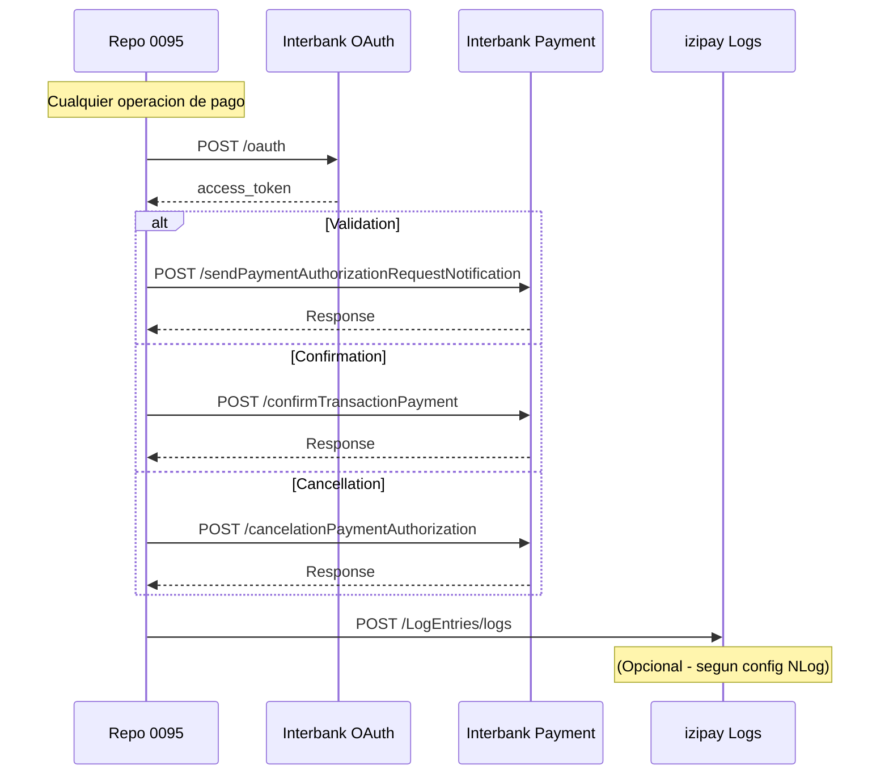

# REPORTE DE ENDPOINTS CONSUMIDOS
## Repositorio: 0095 - ApiBusiness PagoPush

**Fecha de generacion:** Enero 2026
**Proyecto:** izipay-digital-pw.0095.apibusiness.pagopush

---

## Resumen Ejecutivo

El repositorio **0095** consume **5 endpoints externos** distribuidos en **2 proveedores**:

| Proveedor | Cantidad | Proposito |
|-----------|----------|-----------|
| Interbank PagoPush API | 4 | Operaciones de pago |
| izipay (interno) | 1 | Centralizacion de logs |

---

## 1. ENDPOINTS DE INTERBANK PAGOPUSH API

### Ambiente Configurado
```
Base URL: https://apis.uat.interbank.pe
Ambiente: UAT (User Acceptance Testing)
```

---

### 1.1 Generacion de Token OAuth

| Atributo | Valor |
|----------|-------|
| **Nombre** | GenerateAccessToken |
| **URL** | `https://apis.uat.interbank.pe/pago-push/security/v1/oauth` |
| **Metodo HTTP** | `POST` |
| **Content-Type** | `application/x-www-form-urlencoded` |
| **Archivo que lo consume** | `Domain.Core/TokenInterbankDomain.cs:157` |
| **Proposito** | Obtener token de acceso para autenticacion en APIs de Interbank |

#### Headers Requeridos
```
CPA-Apim-Subscription-Key: {CPAKey}
```

#### Request Body (form-urlencoded)
| Campo | Tipo | Descripcion | Valor |
|-------|------|-------------|-------|
| `grant_type` | string | Tipo de autorizacion | `client_credentials` |
| `client_id` | string | ID del cliente | Obtenido de BD |
| `client_secret` | string | Secreto del cliente | Obtenido de BD |
| `scope` | string | Alcance del token | Obtenido de BD |

#### Response Body (JSON)
```json
{
  "token_type": "Bearer",
  "access_token": "eyJ0eXAiOiJKV1QiLCJhbGciOiJS...",
  "expires_in": "3600",
  "ext_expires_in": "3600"
}
```

#### Mapeo de Response
| Campo JSON | Propiedad DTO | Tipo |
|------------|---------------|------|
| `token_type` | `TokenType` | string |
| `access_token` | `AccessToken` | string |
| `expires_in` | `ExpiresIn` | string |
| `ext_expires_in` | `ExtExpiresIn` | string |

#### Cache
- **TTL:** 60 minutos (configurable via `ExpirationTimeTokenIbk`)
- **Key:** `PagoPushToken`

---

### 1.2 Notificacion de Pago (Payment Validation)

| Atributo | Valor |
|----------|-------|
| **Nombre** | PaymentNotification |
| **URL** | `https://apis.uat.interbank.pe/pago-push/payment/v1/sendPaymentAuthorizationRequestNotification` |
| **Metodo HTTP** | `POST` |
| **Content-Type** | `application/json` |
| **Archivo que lo consume** | `Domain.Core/PaymentDomain.cs:66` |
| **Proposito** | Enviar notificacion de solicitud de autorizacion de pago |

#### Headers Requeridos
```
Authorization: Bearer {accessToken}
CPA-Apim-Subscription-Key: {CPAKey}
X-Application-Id: APP
X-Organization-Id: IBK
Content-Type: application/json
```

#### Request Body (JSON)
```json
{
  "typeTransaction": "02",
  "idPasarela": "01",
  "idOrder": "string",
  "idTransactionPasarela": "string",
  "commerce": {
    "code": "string",
    "name": "string"
  },
  "customer": {
    "cellPhoneNumber": "string"
  },
  "pay": {
    "amount": 0.00,
    "money": "string"
  },
  "device": {
    "ip": "string",
    "type": "string"
  }
}
```

#### Mapeo de Request
| Campo | Tipo | Descripcion | Origen |
|-------|------|-------------|--------|
| `typeTransaction` | string | Tipo de transaccion | Constante `"02"` |
| `idPasarela` | string | ID de pasarela izipay | Constante `"01"` |
| `idOrder` | string | ID de orden | Request entrante |
| `idTransactionPasarela` | string | ID transaccion pasarela | Header `transactionId` |
| `commerce.code` | string | Codigo de comercio | Request entrante |
| `commerce.name` | string | Nombre de comercio | Request entrante |
| `customer.cellPhoneNumber` | string | Telefono del cliente | Request entrante |
| `pay.amount` | decimal | Monto a pagar | Request entrante |
| `pay.money` | string | Moneda (PEN/USD) | Request entrante |
| `device.ip` | string | IP del dispositivo | Request entrante |
| `device.type` | string | Tipo de dispositivo | Request entrante |

#### Response Body (JSON) - Exito
```json
{
  "code": "00",
  "message": "Notificacion enviada exitosamente",
  "response": {
    "device": "SAMSUNG-SM-G998B",
    "idTransactionInterbank": "IBK-TRX-123456789"
  },
  "header": {
    "transactionStartDatetime": "2026-01-09T10:30:00.000",
    "transactionEndDatetime": "2026-01-09T10:30:02.500",
    "millis": "2500"
  }
}
```

#### Mapeo de Response - PaymentNotification
| Campo JSON | Propiedad DTO | Tipo | Descripcion |
|------------|---------------|------|-------------|
| `code` | `Code` | string | Codigo de resultado ("00" = exito) |
| `message` | `Message` | string | Mensaje descriptivo |
| `response.device` | `Response.Device` | **string** | Identificador del dispositivo del usuario PLIN |
| `response.idTransactionInterbank` | `Response.IdTransactionInterbank` | string | ID de transaccion generado por Interbank |
| `header.transactionStartDatetime` | `Header.TransactionStartDatetime` | string | Fecha/hora inicio |
| `header.transactionEndDatetime` | `Header.TransactionEndDatetime` | string | Fecha/hora fin |
| `header.millis` | `Header.Millis` | string | Duracion en milisegundos |

> **NOTA:** El campo `device` es un **string**, no un objeto. Contiene el identificador del dispositivo del usuario PLIN.

#### Response Body (JSON) - Error
```json
{
  "ErrorCode": "P01",
  "ErrorMessage": "El numero de celular no esta registrado en PLIN"
}
```

#### Politica de Reintentos
| Parametro | Valor | Configuracion |
|-----------|-------|---------------|
| Max reintentos | 3 | `Config:NotificationFailed` |
| Tiempo espera | 5 seg | `Config:NotificationWaitTime` |
| Codigos retry | 0, 404, 500, 503, 504 | Hardcoded |

---

### 1.3 Confirmacion de Pago

| Atributo | Valor |
|----------|-------|
| **Nombre** | PaymentConfirm |
| **URL** | `https://apis.uat.interbank.pe/pago-push/payment/v1/confirmTransactionPayment` |
| **Metodo HTTP** | `POST` |
| **Content-Type** | `application/json` |
| **Archivo que lo consume** | `Domain.Core/ConfirmDomain.cs:44` |
| **Proposito** | Confirmar una transaccion de pago autorizada |

#### Headers Requeridos
```
Authorization: Bearer {accessToken}
CPA-Apim-Subscription-Key: {CPAKey}
X-Application-Id: APP
X-Organization-Id: IBK
Content-Type: application/json
```

#### Request Body (JSON)
```json
{
  "idPasarela": "01",
  "idOrder": "string",
  "idTransactionPasarela": "string",
  "commerce": {
    "code": "string",
    "name": "string"
  },
  "transaction": {
    "resultCode": "string",
    "resultMessage": "string",
    "result": "string",
    "currency": "string",
    "amount": "string",
    "authorizationDate": "string",
    "authorizationTime": "string",
    "authorizationCode": "string"
  },
  "device": {
    "ip": "string",
    "type": "string"
  }
}
```

#### Mapeo de Request
| Campo | Tipo | Descripcion |
|-------|------|-------------|
| `idPasarela` | string | ID pasarela izipay (constante "01") |
| `idOrder` | string | ID de orden |
| `idTransactionPasarela` | string | ID transaccion de pasarela |
| `commerce.code` | string | Codigo de comercio |
| `commerce.name` | string | Nombre de comercio |
| `transaction.resultCode` | string | Codigo de resultado |
| `transaction.resultMessage` | string | Mensaje de resultado |
| `transaction.result` | string | Resultado |
| `transaction.currency` | string | Moneda |
| `transaction.amount` | string | Monto |
| `transaction.authorizationDate` | string | Fecha autorizacion |
| `transaction.authorizationTime` | string | Hora autorizacion |
| `transaction.authorizationCode` | string | Codigo autorizacion |
| `device.ip` | string | IP del dispositivo |
| `device.type` | string | Tipo de dispositivo |

#### Response Body (JSON) - Exito Confirmacion
```json
{
  "code": "00",
  "message": "Transaccion confirmada exitosamente",
  "response": null,
  "header": {
    "transactionStartDatetime": "2026-01-09T10:32:00.000",
    "transactionEndDatetime": "2026-01-09T10:32:01.800",
    "millis": "1800"
  }
}
```

#### Mapeo de Response - Confirmation
| Campo JSON | Propiedad DTO | Tipo | Descripcion |
|------------|---------------|------|-------------|
| `code` | `Code` | string | Codigo de resultado ("00" = exito) |
| `message` | `Message` | string | Mensaje descriptivo |
| `response` | `Response` | **null** | ResponseConfirmDto esta vacio (sin propiedades) |
| `header` | `Header` | HeaderResponseDto | Metadata de tiempos |

> **NOTA:** El DTO `ResponseConfirmDto` esta definido como clase vacia, por lo que `response` sera `null` o `{}`.

#### Response Body (JSON) - Error Confirmacion
```json
{
  "ErrorCode": "403",
  "ErrorMessage": "Error de comunicacion con el servicio"
}
```

#### Politica de Reintentos
- Misma configuracion que PaymentNotification

---

### 1.4 Cancelacion/Anulacion de Pago

| Atributo | Valor |
|----------|-------|
| **Nombre** | PaymentAnnulment |
| **URL** | `https://apis.uat.interbank.pe/pago-push/payment/v1/cancelationPaymentAuthorization` |
| **Metodo HTTP** | `POST` |
| **Content-Type** | `application/json` |
| **Archivo que lo consume** | `Domain.Core/CancelDomain.cs:43` |
| **Proposito** | Cancelar/anular una solicitud de autorizacion de pago |

#### Headers Requeridos
```
Authorization: Bearer {accessToken}
CPA-Apim-Subscription-Key: {CPAKey}
X-Application-Id: APP
X-Organization-Id: IBK
Content-Type: application/json
```

#### Request Body (JSON)
```json
{
  "idPasarela": "01",
  "idOrder": "string",
  "idTransactionPasarela": "string",
  "commerce": {
    "code": "string",
    "name": "string"
  },
  "action": {
    "actionCode": "00",
    "actionMessage": "Cerro Pasarela"
  },
  "device": {
    "ip": "string",
    "type": "string"
  }
}
```

#### Mapeo de Request
| Campo | Tipo | Descripcion | Valor |
|-------|------|-------------|-------|
| `idPasarela` | string | ID pasarela | Constante `"01"` |
| `idOrder` | string | ID de orden | Request entrante |
| `idTransactionPasarela` | string | ID transaccion | Header transactionId |
| `commerce.code` | string | Codigo comercio | Request entrante |
| `commerce.name` | string | Nombre comercio | Request entrante |
| `action.actionCode` | string | Codigo accion | Constante `"00"` |
| `action.actionMessage` | string | Mensaje accion | Constante `"Cerro Pasarela"` |
| `device.ip` | string | IP dispositivo | Request entrante |
| `device.type` | string | Tipo dispositivo | Request entrante |

#### Response Body (JSON) - Exito Cancelacion
```json
{
  "code": "00",
  "message": "Transaccion cancelada exitosamente",
  "response": null,
  "header": {
    "transactionStartDatetime": "2026-01-09T10:32:00.000",
    "transactionEndDatetime": "2026-01-09T10:32:01.500",
    "millis": "1500"
  }
}
```

#### Mapeo de Response - Cancel
| Campo JSON | Propiedad DTO | Tipo | Descripcion |
|------------|---------------|------|-------------|
| `code` | `Code` | string | Codigo de resultado ("00" = exito) |
| `message` | `Message` | string | Mensaje descriptivo |
| `response` | `Response` | **null** | ResponseCancelDto esta vacio (sin propiedades) |
| `header` | `Header` | HeaderResponseDto | Metadata de tiempos |

> **NOTA:** El DTO `ResponseCancelDto` esta definido como clase vacia, por lo que `response` sera `null` o `{}`.

#### Response Body (JSON) - Error Cancelacion
```json
{
  "ErrorCode": "403",
  "ErrorMessage": "Error de comunicacion con el servicio"
}
```

#### Politica de Reintentos
- Misma configuracion que PaymentNotification

---

## 2. ENDPOINT DE LOGGING HTTP (INTERNO)

| Atributo | Valor |
|----------|-------|
| **Nombre** | HTTP Log Target |
| **URL** | `https://testapicontroller.izipay.pe/LogEntries/logs` |
| **Metodo HTTP** | `POST` |
| **Content-Type** | `application/json` |
| **Archivo configuracion** | `ApiPaymentController/nlog.config:24` |
| **Proposito** | Centralizacion de logs del sistema |
| **Estado** | Configurado pero comentado en reglas de NLog |

#### Request Body (JSON)
```json
{
  "message": "string",
  "level": "INFO|ERROR|WARN",
  "logger": "string",
  "exception": "string",
  "server": "local",
  "api": "0095_business",
  "timestamp": "2026-01-09T10:30:00.000Z"
}
```

---

## 3. DIAGRAMA DE FLUJO DE ENDPOINTS



---

## 4. MATRIZ DE DEPENDENCIAS

| Endpoint | Domain Service | Application Service | Controller |
|----------|---------------|---------------------|------------|
| GenerateAccessToken | TokenInterbankDomain | - | - |
| PaymentNotification | PaymentDomain | PaymentApplication | PaymentController.Validation |
| PaymentConfirm | ConfirmDomain | ConfirmApplication | PaymentController.Confirmation |
| PaymentAnnulment | CancelDomain | CancelApplication | PaymentController.Cancel |

---

## 5. CONFIGURACION DE ENDPOINTS

### Archivo: `appsettings.json`

```json
{
  "PagoPushEndPoints": {
    "GenerateAccessToken": "https://apis.uat.interbank.pe/pago-push/security/v1/oauth",
    "PaymentNotification": "https://apis.uat.interbank.pe/pago-push/payment/v1/sendPaymentAuthorizationRequestNotification",
    "PaymentAnnulment": "https://apis.uat.interbank.pe/pago-push/payment/v1/cancelationPaymentAuthorization",
    "PaymentConfirm": "https://apis.uat.interbank.pe/pago-push/payment/v1/confirmTransactionPayment"
  }
}
```

### Clase de Configuracion: `Application.DTO/AppSettings/EndPoints.cs`

```csharp
public class EndPoints
{
    public string GenerateAccessToken { get; set; }
    public string PaymentNotification { get; set; }
    public string PaymentAnnulment { get; set; }
    public string PaymentConfirm { get; set; }
}
```

---

## 6. HEADERS COMUNES

### Headers para Autenticacion OAuth
| Header | Valor | Descripcion |
|--------|-------|-------------|
| `CPA-Apim-Subscription-Key` | `{CPAKey}` | Key de suscripcion API Management |

### Headers para Operaciones de Pago
| Header | Valor | Descripcion |
|--------|-------|-------------|
| `Authorization` | `Bearer {token}` | Token OAuth |
| `CPA-Apim-Subscription-Key` | `{CPAKey}` | Key de suscripcion |
| `X-Application-Id` | `APP` | ID de aplicacion |
| `X-Organization-Id` | `IBK` | ID de organizacion |
| `Content-Type` | `application/json` | Tipo de contenido |

---

## 7. MANEJO DE ERRORES

### Estructura de Error de Interbank
```json
{
  "ErrorCode": "string",
  "ErrorMessage": "string"
}
```

### Codigos de Respuesta por Endpoint

#### PaymentNotification (Validation)
| Codigo | Descripcion | Accion |
|--------|-------------|--------|
| `00` | Notificacion enviada exitosamente | Continuar flujo |
| `P01` | Celular no registrado en PLIN | Informar al cliente |
| `P02` | Usuario PLIN inactivo | Contactar banco |
| `P03` | Formato de celular invalido | Verificar numero |
| `P04` | Limite excedido | Intentar otro dia |
| `P05` | Monto invalido | Ajustar monto |

#### PaymentConfirm (Confirmation)
| Codigo | Descripcion | Accion |
|--------|-------------|--------|
| `00` | Transaccion confirmada | Cobro exitoso |
| `403` | Error de comunicacion | Reintentar/Verificar |
| `500` | Error interno Interbank | Contactar soporte |

#### PaymentAnnulment (Cancel)
| Codigo | Descripcion | Accion |
|--------|-------------|--------|
| `00` | Transaccion cancelada | Finalizado |
| `403` | Error de comunicacion | Reintentar |
| `500` | Error interno Interbank | Contactar soporte |

### Codigos HTTP que Disparan Reintento
| HTTP Status | Descripcion | Comportamiento |
|-------------|-------------|----------------|
| `0` | Sin respuesta | Reintento automatico |
| `404` | No encontrado | Reintento automatico |
| `500` | Error interno servidor | Reintento automatico |
| `503` | Servicio no disponible | Reintento automatico |
| `504` | Gateway timeout | Reintento automatico |

> **Configuracion de reintentos:** Max 3 intentos con 5 segundos de espera entre cada uno.

---

## 8. CREDENCIALES REQUERIDAS

Las credenciales se obtienen de la base de datos SQL Server mediante el stored procedure `Push.sp_GetCredentials`:

| Credencial | Descripcion | Uso |
|------------|-------------|-----|
| `CLIENTID_PAGOPUSH` | Client ID OAuth | Autenticacion |
| `CLIENTSECRET_PAGOPUSH` | Client Secret OAuth | Autenticacion |
| `SCOPE_PAGOPUSH` | Scope del token | Autenticacion |
| `CPA_KEY_PAGOPUSH` | API Management Key | Headers |

### Cache de Credenciales
- **TTL:** 120 minutos (configurable via `ExpirationTimePagoPushCredentials`)
- **Key:** `PagoPushCredentials`

---

## 9. SEGURIDAD

### TLS/SSL
- Protocolo: TLS 1.3
- Validacion de certificado: Deshabilitada (desarrollo)
  ```csharp
  ServerCertificateCustomValidationCallback = (sender, cert, chain, sslPolicyErrors) => true
  ```

> **ADVERTENCIA:** En produccion debe habilitarse la validacion de certificados.

---

## 10. RESUMEN DE URLs

| # | URL Completa | Metodo | Proposito |
|---|--------------|--------|-----------|
| 1 | `https://apis.uat.interbank.pe/pago-push/security/v1/oauth` | POST | Token OAuth |
| 2 | `https://apis.uat.interbank.pe/pago-push/payment/v1/sendPaymentAuthorizationRequestNotification` | POST | Validacion pago |
| 3 | `https://apis.uat.interbank.pe/pago-push/payment/v1/confirmTransactionPayment` | POST | Confirmacion pago |
| 4 | `https://apis.uat.interbank.pe/pago-push/payment/v1/cancelationPaymentAuthorization` | POST | Cancelacion pago |
| 5 | `https://testapicontroller.izipay.pe/LogEntries/logs` | POST | Logging HTTP |

---

## 11. ESTRUCTURA DE DTOs DE RESPUESTA

### ResponseBaseDto<T> (Clase base generica)
**Archivo:** `Application.DTO/Response/ResponseBaseDto.cs`
```csharp
public class ResponseBaseDto<T>
{
    public string Code { get; set; }              // Codigo de resultado
    public string Message { get; set; }           // Mensaje descriptivo
    public T Response { get; set; }               // Payload generico
    public HeaderResponseDto Header { get; set; } // Metadata de tiempos
    public int StatusCode { get; set; }           // HTTP Status (interno)
}
```

### HeaderResponseDto
```csharp
public class HeaderResponseDto
{
    public string TransactionStartDatetime { get; set; }  // Inicio
    public string TransactionEndDatetime { get; set; }    // Fin
    public string Millis { get; set; }                    // Duracion ms
}
```

### ResponseDto (PaymentNotification)
**Archivo:** `Application.DTO/Response/ResponseDto.cs`
```csharp
public class ResponseDto : ResponseBaseDto<JsonResponseBody>
{
    // Hereda de ResponseBaseDto con Response = JsonResponseBody
}

public class JsonResponseBody
{
    public string Device { get; set; }                // STRING - Dispositivo usuario PLIN
    public string IdTransactionInterbank { get; set; } // ID transaccion IBK
}
```

### ResponseConfirmDto (Confirmation)
**Archivo:** `Application.DTO/Response/ResponseConfirmDto.cs`
```csharp
public class ResponseConfirmDto
{
    // Clase VACIA - sin propiedades
    // Response sera null o {}
}
```

### ResponseCancelDto (Cancel)
**Archivo:** `Application.DTO/Response/ResponseCancelDto.cs`
```csharp
public class ResponseCancelDto
{
    // Clase VACIA - sin propiedades
    // Response sera null o {}
}
```

### ErrorResponseDto (Errores de Interbank)
**Archivo:** `Application.DTO/Response/ErrorResponseDto.cs`
```csharp
public class ErrorResponseDto
{
    public string ErrorCode { get; set; }     // Codigo de error
    public string ErrorMessage { get; set; }  // Mensaje de error
}
```

### NotFoundResponseDto
**Archivo:** `Application.DTO/Response/NotFoundResponseDto.cs`
```csharp
public class NotFoundResponseDto
{
    public string StatusCode { get; set; }  // Codigo HTTP
    public string Message { get; set; }     // Mensaje
}
```

---

## 12. NOTAS IMPORTANTES

### Sobre el campo `device` en PaymentNotification
- El campo `device` en `JsonResponseBody` es de tipo **string**, NO un objeto
- Contiene el identificador del dispositivo del usuario PLIN (ej: "SAMSUNG-SM-G998B")
- Este valor es retornado por Interbank al procesar la notificacion

### Sobre ResponseConfirmDto y ResponseCancelDto
- Ambos DTOs estan definidos como clases vacias (sin propiedades)
- El campo `response` en la respuesta sera `null` o `{}`
- Solo se utilizan `code` y `message` para determinar el resultado

### Sobre el campo `statusCode`
- `StatusCode` en `ResponseBaseDto` tiene el atributo `[JsonIgnore]`
- Es un campo interno usado para el manejo de respuestas HTTP
- No se serializa en la respuesta JSON al cliente

---

*Reporte generado y corregido para el repositorio 0095 - ApiBusiness PagoPush*
*Ultima actualizacion: Enero 2026*
