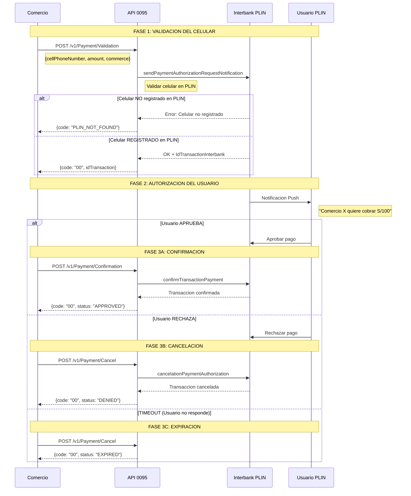
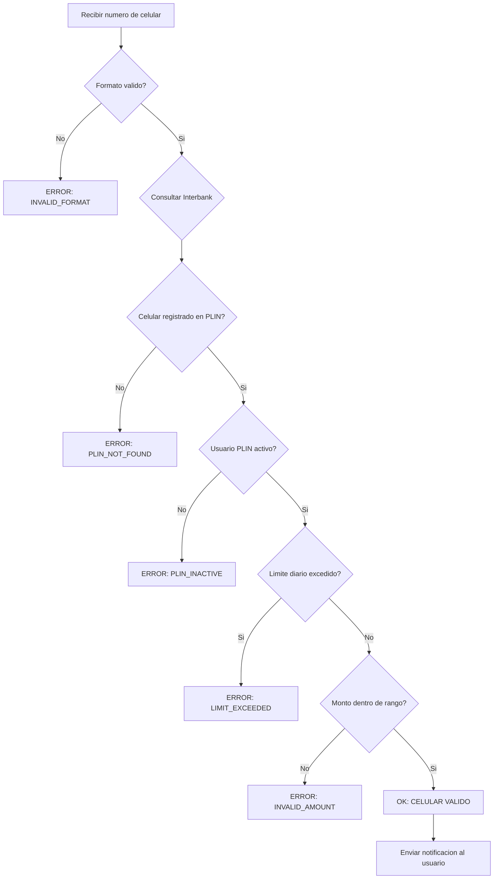
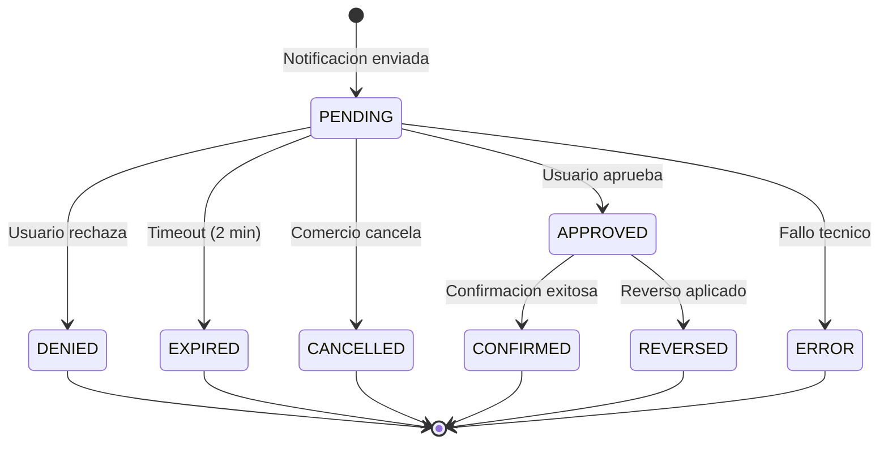
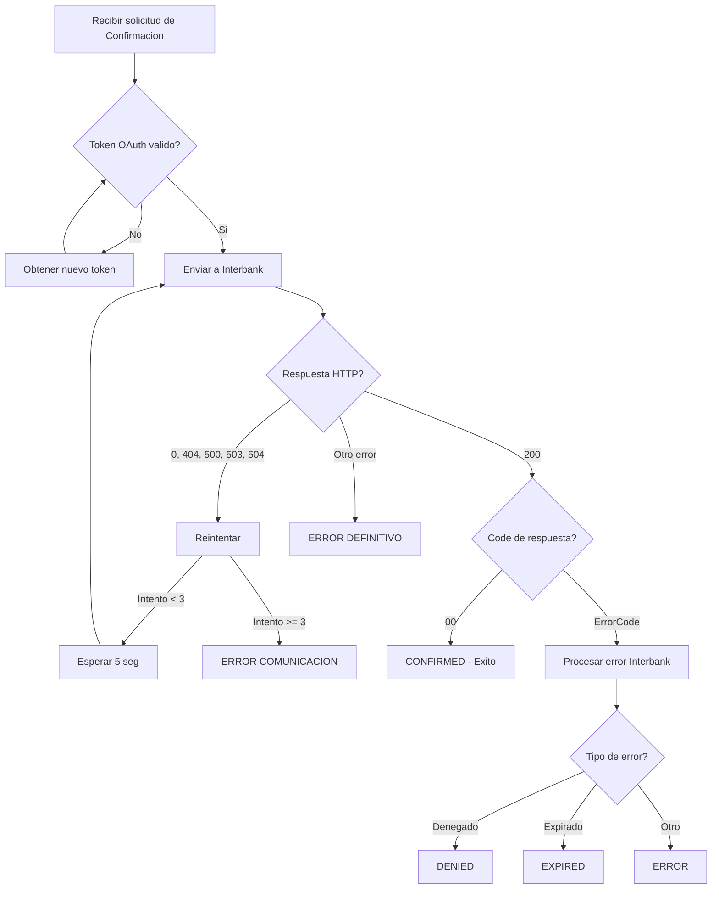
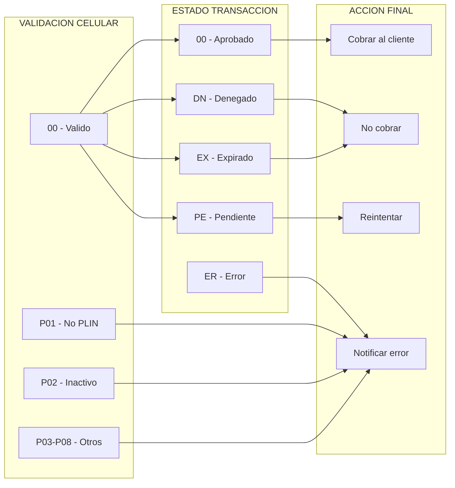

# GUIA COMPLETA DE VALIDACIONES PAGO PLIN
## Repositorio: 0095 - ApiBusiness PagoPush

**Fecha de generacion:** Enero 2026
**Sistema:** Pago PLIN (PagoPush Interbank)
**Proposito:** Validacion de numero de celular y estados de transaccion

---

## 1. RESUMEN EJECUTIVO

Este documento describe las dos validaciones principales del sistema Pago PLIN:

| Validacion | Descripcion | Momento |
|------------|-------------|---------|
| **Celular PLIN** | Verifica si el numero esta registrado en PLIN | Al enviar notificacion |
| **Estado Transaccion** | Resultado del pago (aprobado/denegado/otro) | Al confirmar/cancelar |

---

## 2. FLUJO COMPLETO DE PAGO PLIN



---

## 3. VALIDACION DEL NUMERO DE CELULAR PLIN

### 3.1 Diagrama de Decision



### 3.2 Codigos de Respuesta - Validacion Celular

| Codigo | Estado | Descripcion | Accion Sugerida |
|--------|--------|-------------|-----------------|
| `00` | VALID | Celular registrado y activo en PLIN | Continuar con el pago |
| `P01` | PLIN_NOT_FOUND | Celular no registrado en PLIN | Informar al cliente que debe registrarse |
| `P02` | PLIN_INACTIVE | Usuario PLIN inactivo/suspendido | Contactar al banco |
| `P03` | INVALID_FORMAT | Formato de celular invalido | Verificar numero (9 digitos) |
| `P04` | LIMIT_EXCEEDED | Limite diario/mensual excedido | Intentar otro dia |
| `P05` | INVALID_AMOUNT | Monto fuera del rango permitido | Ajustar monto |
| `P06` | SERVICE_UNAVAILABLE | Servicio PLIN no disponible | Reintentar mas tarde |
| `P07` | BANK_NOT_SUPPORTED | Banco del celular no soporta PLIN | Usar otro metodo de pago |
| `P08` | DUPLICATE_REQUEST | Solicitud duplicada | Verificar transaccion previa |

### 3.3 Request de Validacion

```json
{
  "commerce": {
    "code": "COMERCIO001",
    "name": "Mi Comercio SAC"
  },
  "customer": {
    "cellPhoneNumber": "987654321"
  },
  "pay": {
    "amount": 150.50,
    "money": "PEN"
  },
  "device": {
    "ip": "192.168.1.100",
    "type": "WEB"
  },
  "idOrder": "ORD-2026-001234"
}
```

### 3.4 Respuestas de Validacion

**Celular VALIDO:**
```json
{
  "code": "00",
  "message": "Celular registrado en PLIN. Notificacion enviada al usuario.",
  "statusCode": 200,
  "response": {
    "device": "SAMSUNG-SM-G998B",
    "idTransactionInterbank": "IBK-TRX-123456789"
  },
  "header": {
    "transactionStartDatetime": "2026-01-09T10:30:00.000",
    "transactionEndDatetime": "2026-01-09T10:30:02.500",
    "millis": "2500"
  }
}
```

**Celular NO registrado:**
```json
{
  "code": "P01",
  "message": "El numero de celular no esta registrado en PLIN",
  "statusCode": 200,
  "response": null,
  "header": {
    "transactionStartDatetime": "2026-01-09T10:30:00.000",
    "transactionEndDatetime": "2026-01-09T10:30:01.200",
    "millis": "1200"
  }
}
```

**Celular INACTIVO:**
```json
{
  "code": "P02",
  "message": "El usuario PLIN se encuentra inactivo o suspendido",
  "statusCode": 200,
  "response": null,
  "header": {
    "transactionStartDatetime": "2026-01-09T10:30:00.000",
    "transactionEndDatetime": "2026-01-09T10:30:01.100",
    "millis": "1100"
  }
}
```

---

## 4. VALIDACION DEL ESTADO DE TRANSACCION

### 4.1 Diagrama de Estados



### 4.2 Estados de Transaccion

| Estado | Codigo | Descripcion | Es Final? |
|--------|--------|-------------|-----------|
| `PENDING` | `PE` | Esperando respuesta del usuario | No |
| `APPROVED` | `00` | Usuario aprobo el pago | Si |
| `DENIED` | `DN` | Usuario rechazo el pago | Si |
| `EXPIRED` | `EX` | Tiempo de espera agotado (2 min) | Si |
| `CANCELLED` | `CA` | Comercio cancelo la operacion | Si |
| `CONFIRMED` | `CF` | Transaccion confirmada exitosamente | Si |
| `REVERSED` | `RV` | Transaccion reversada | Si |
| `ERROR` | `ER` | Error en el procesamiento | Si |

### 4.3 Codigos de Respuesta - Estado Transaccion

| Codigo | Estado | Descripcion | HTTP |
|--------|--------|-------------|------|
| `00` | APPROVED | Transaccion aprobada por el usuario | 200 |
| `DN` | DENIED | Usuario rechazo el pago | 200 |
| `EX` | EXPIRED | Tiempo de espera agotado | 200 |
| `CA` | CANCELLED | Cancelado por el comercio | 200 |
| `PE` | PENDING | En espera de autorizacion | 202 |
| `CF` | CONFIRMED | Confirmado exitosamente | 200 |
| `RV` | REVERSED | Reverso aplicado | 200 |
| `ER` | ERROR | Error de procesamiento | 500 |
| `403` | COMM_ERROR | Error de comunicacion | 503 |

### 4.4 Flujo de Confirmacion



### 4.5 Request de Confirmacion (Aprobado)

```json
{
  "commerce": {
    "code": "COMERCIO001",
    "name": "Mi Comercio SAC"
  },
  "transaction": {
    "resultCode": "00",
    "resultMessage": "Transaccion aprobada",
    "result": "APPROVED",
    "currency": "PEN",
    "amount": "150.50",
    "authorizationDate": "2026-01-09",
    "authorizationTime": "10:32:15",
    "authorizationCode": "AUTH123456"
  },
  "device": {
    "ip": "192.168.1.100",
    "type": "WEB"
  },
  "idOrder": "ORD-2026-001234"
}
```

### 4.6 Request de Cancelacion (Denegado/Expirado)

```json
{
  "commerce": {
    "code": "COMERCIO001",
    "name": "Mi Comercio SAC"
  },
  "device": {
    "ip": "192.168.1.100",
    "type": "WEB"
  },
  "idOrder": "ORD-2026-001234"
}
```

### 4.7 Respuestas por Estado

**APPROVED (Aprobado):**
```json
{
  "code": "00",
  "message": "Transaccion aprobada exitosamente",
  "statusCode": 200,
  "response": {
    "idTransactionInterbank": "IBK-TRX-123456789",
    "authorizationCode": "AUTH123456"
  },
  "header": {
    "transactionStartDatetime": "2026-01-09T10:32:00.000",
    "transactionEndDatetime": "2026-01-09T10:32:01.800",
    "millis": "1800"
  }
}
```

**DENIED (Denegado por usuario):**
```json
{
  "code": "DN",
  "message": "El usuario rechazo la solicitud de pago",
  "statusCode": 200,
  "response": null,
  "header": {
    "transactionStartDatetime": "2026-01-09T10:32:00.000",
    "transactionEndDatetime": "2026-01-09T10:32:01.500",
    "millis": "1500"
  }
}
```

**EXPIRED (Tiempo agotado):**
```json
{
  "code": "EX",
  "message": "Tiempo de espera agotado. El usuario no respondio.",
  "statusCode": 200,
  "response": null,
  "header": {
    "transactionStartDatetime": "2026-01-09T10:30:00.000",
    "transactionEndDatetime": "2026-01-09T10:32:00.000",
    "millis": "120000"
  }
}
```

**PENDING (En proceso):**
```json
{
  "code": "PE",
  "message": "Transaccion en proceso. Esperando autorizacion del usuario.",
  "statusCode": 202,
  "response": {
    "idTransactionInterbank": "IBK-TRX-123456789"
  },
  "header": {
    "transactionStartDatetime": "2026-01-09T10:30:00.000",
    "transactionEndDatetime": "2026-01-09T10:30:02.000",
    "millis": "2000"
  }
}
```

**ERROR (Fallo tecnico):**
```json
{
  "code": "403",
  "message": "Error de comunicacion con el servicio PLIN",
  "statusCode": 503,
  "response": null,
  "header": {
    "transactionStartDatetime": "2026-01-09T10:30:00.000",
    "transactionEndDatetime": "2026-01-09T10:30:15.000",
    "millis": "15000"
  }
}
```

---

## 5. MATRIZ COMPLETA DE CODIGOS

### 5.1 Codigos de Validacion de Celular

| Codigo | Constante | Categoria | Mensaje | HTTP |
|--------|-----------|-----------|---------|------|
| `00` | `PLIN_VALID` | EXITO | Celular valido | 200 |
| `P01` | `PLIN_NOT_FOUND` | CELULAR | No registrado en PLIN | 200 |
| `P02` | `PLIN_INACTIVE` | CELULAR | Usuario inactivo | 200 |
| `P03` | `INVALID_FORMAT` | CELULAR | Formato invalido | 400 |
| `P04` | `LIMIT_EXCEEDED` | LIMITE | Limite excedido | 200 |
| `P05` | `INVALID_AMOUNT` | MONTO | Monto invalido | 400 |
| `P06` | `SERVICE_UNAVAILABLE` | ERROR | Servicio no disponible | 503 |
| `P07` | `BANK_NOT_SUPPORTED` | CELULAR | Banco no soportado | 200 |
| `P08` | `DUPLICATE_REQUEST` | ERROR | Solicitud duplicada | 409 |

### 5.2 Codigos de Estado de Transaccion

| Codigo | Constante | Categoria | Mensaje | HTTP |
|--------|-----------|-----------|---------|------|
| `00` | `APPROVED` | EXITO | Aprobado | 200 |
| `DN` | `DENIED` | DENEGADO | Usuario rechazo | 200 |
| `EX` | `EXPIRED` | DENEGADO | Tiempo agotado | 200 |
| `CA` | `CANCELLED` | CANCELADO | Comercio cancelo | 200 |
| `PE` | `PENDING` | PROCESO | En espera | 202 |
| `CF` | `CONFIRMED` | EXITO | Confirmado | 200 |
| `RV` | `REVERSED` | REVERSO | Reversado | 200 |
| `ER` | `ERROR` | ERROR | Error procesamiento | 500 |
| `403` | `COMM_ERROR` | ERROR | Error comunicacion | 503 |

### 5.3 Matriz de Decision



---

## 6. IMPLEMENTACION PROPUESTA

### 6.1 Enums de Estado

**Archivo:** `Application.DTO/Common/PLINStatus.cs`

```csharp
namespace Application.DTO.Common
{
    /// <summary>
    /// Estados de validacion del numero de celular PLIN
    /// </summary>
    public enum CellPhoneValidationStatus
    {
        /// <summary>Celular registrado y activo en PLIN</summary>
        VALID = 0,

        /// <summary>Celular no registrado en PLIN</summary>
        NOT_FOUND = 1,

        /// <summary>Usuario PLIN inactivo/suspendido</summary>
        INACTIVE = 2,

        /// <summary>Formato de celular invalido</summary>
        INVALID_FORMAT = 3,

        /// <summary>Limite excedido</summary>
        LIMIT_EXCEEDED = 4,

        /// <summary>Monto fuera de rango</summary>
        INVALID_AMOUNT = 5,

        /// <summary>Servicio no disponible</summary>
        SERVICE_UNAVAILABLE = 6,

        /// <summary>Banco no soportado</summary>
        BANK_NOT_SUPPORTED = 7,

        /// <summary>Solicitud duplicada</summary>
        DUPLICATE = 8
    }

    /// <summary>
    /// Estados de la transaccion PLIN
    /// </summary>
    public enum PLINTransactionStatus
    {
        /// <summary>Transaccion aprobada</summary>
        APPROVED = 0,

        /// <summary>Usuario rechazo el pago</summary>
        DENIED = 1,

        /// <summary>Tiempo de espera agotado</summary>
        EXPIRED = 2,

        /// <summary>Comercio cancelo</summary>
        CANCELLED = 3,

        /// <summary>En espera de autorizacion</summary>
        PENDING = 4,

        /// <summary>Confirmado exitosamente</summary>
        CONFIRMED = 5,

        /// <summary>Reversado</summary>
        REVERSED = 6,

        /// <summary>Error de procesamiento</summary>
        ERROR = 7
    }
}
```

### 6.2 Constantes PLIN

**Agregar a:** `Transversal.Common/Constants.cs`

```csharp
/// <summary>
/// Codigos de respuesta PLIN - Validacion de celular
/// </summary>
public struct PLINCellPhoneCodes
{
    public const string VALID = "00";
    public const string NOT_FOUND = "P01";
    public const string INACTIVE = "P02";
    public const string INVALID_FORMAT = "P03";
    public const string LIMIT_EXCEEDED = "P04";
    public const string INVALID_AMOUNT = "P05";
    public const string SERVICE_UNAVAILABLE = "P06";
    public const string BANK_NOT_SUPPORTED = "P07";
    public const string DUPLICATE = "P08";
}

/// <summary>
/// Codigos de respuesta PLIN - Estado de transaccion
/// </summary>
public struct PLINTransactionCodes
{
    public const string APPROVED = "00";
    public const string DENIED = "DN";
    public const string EXPIRED = "EX";
    public const string CANCELLED = "CA";
    public const string PENDING = "PE";
    public const string CONFIRMED = "CF";
    public const string REVERSED = "RV";
    public const string ERROR = "ER";
    public const string COMM_ERROR = "403";
}

/// <summary>
/// Mensajes de respuesta PLIN
/// </summary>
public struct PLINMessages
{
    // Celular
    public const string CELL_VALID = "Celular registrado en PLIN. Notificacion enviada.";
    public const string CELL_NOT_FOUND = "El numero de celular no esta registrado en PLIN";
    public const string CELL_INACTIVE = "El usuario PLIN se encuentra inactivo";
    public const string CELL_INVALID = "Formato de numero de celular invalido";
    public const string CELL_LIMIT = "Limite de transacciones excedido";

    // Transaccion
    public const string TXN_APPROVED = "Transaccion aprobada exitosamente";
    public const string TXN_DENIED = "El usuario rechazo la solicitud de pago";
    public const string TXN_EXPIRED = "Tiempo de espera agotado";
    public const string TXN_CANCELLED = "Transaccion cancelada por el comercio";
    public const string TXN_PENDING = "Esperando autorizacion del usuario";
    public const string TXN_ERROR = "Error en el procesamiento de la transaccion";
}
```

### 6.3 Clase Validadora PLIN

**Archivo nuevo:** `Domain.Core/Validators/PLINValidator.cs`

```csharp
using Application.DTO.Common;
using System.Collections.Generic;
using System.Text.RegularExpressions;
using Transversal.Common;

namespace Domain.Core.Validators
{
    /// <summary>
    /// Validador de operaciones PLIN
    /// </summary>
    public static class PLINValidator
    {
        // Regex para numero de celular peruano (9 digitos, empieza con 9)
        private static readonly Regex CellPhoneRegex = new Regex(@"^9\d{8}$");

        // Codigos de celular valido
        private static readonly HashSet<string> ValidCellPhoneCodes = new HashSet<string>
        {
            Constants.PLINCellPhoneCodes.VALID
        };

        // Codigos de transaccion aprobada
        private static readonly HashSet<string> ApprovedTransactionCodes = new HashSet<string>
        {
            Constants.PLINTransactionCodes.APPROVED,
            Constants.PLINTransactionCodes.CONFIRMED
        };

        // Codigos de transaccion denegada
        private static readonly HashSet<string> DeniedTransactionCodes = new HashSet<string>
        {
            Constants.PLINTransactionCodes.DENIED,
            Constants.PLINTransactionCodes.EXPIRED,
            Constants.PLINTransactionCodes.CANCELLED
        };

        #region Validacion de Celular

        /// <summary>
        /// Valida el formato del numero de celular
        /// </summary>
        public static bool IsValidCellPhoneFormat(string cellPhone)
        {
            if (string.IsNullOrWhiteSpace(cellPhone))
                return false;

            return CellPhoneRegex.IsMatch(cellPhone.Trim());
        }

        /// <summary>
        /// Valida el estado del celular segun respuesta de Interbank
        /// </summary>
        public static CellPhoneValidationStatus ValidateCellPhoneResponse(string responseCode)
        {
            if (string.IsNullOrWhiteSpace(responseCode))
                return CellPhoneValidationStatus.SERVICE_UNAVAILABLE;

            return responseCode.ToUpper() switch
            {
                "00" => CellPhoneValidationStatus.VALID,
                "P01" => CellPhoneValidationStatus.NOT_FOUND,
                "P02" => CellPhoneValidationStatus.INACTIVE,
                "P03" => CellPhoneValidationStatus.INVALID_FORMAT,
                "P04" => CellPhoneValidationStatus.LIMIT_EXCEEDED,
                "P05" => CellPhoneValidationStatus.INVALID_AMOUNT,
                "P06" => CellPhoneValidationStatus.SERVICE_UNAVAILABLE,
                "P07" => CellPhoneValidationStatus.BANK_NOT_SUPPORTED,
                "P08" => CellPhoneValidationStatus.DUPLICATE,
                _ => CellPhoneValidationStatus.SERVICE_UNAVAILABLE
            };
        }

        /// <summary>
        /// Indica si el celular es valido para PLIN
        /// </summary>
        public static bool IsCellPhoneValid(string responseCode)
        {
            return ValidCellPhoneCodes.Contains(responseCode?.ToUpper() ?? "");
        }

        /// <summary>
        /// Obtiene mensaje para el estado del celular
        /// </summary>
        public static string GetCellPhoneMessage(CellPhoneValidationStatus status)
        {
            return status switch
            {
                CellPhoneValidationStatus.VALID => Constants.PLINMessages.CELL_VALID,
                CellPhoneValidationStatus.NOT_FOUND => Constants.PLINMessages.CELL_NOT_FOUND,
                CellPhoneValidationStatus.INACTIVE => Constants.PLINMessages.CELL_INACTIVE,
                CellPhoneValidationStatus.INVALID_FORMAT => Constants.PLINMessages.CELL_INVALID,
                CellPhoneValidationStatus.LIMIT_EXCEEDED => Constants.PLINMessages.CELL_LIMIT,
                _ => "Error al validar el numero de celular"
            };
        }

        #endregion

        #region Validacion de Transaccion

        /// <summary>
        /// Valida el estado de la transaccion
        /// </summary>
        public static PLINTransactionStatus ValidateTransactionResponse(string responseCode)
        {
            if (string.IsNullOrWhiteSpace(responseCode))
                return PLINTransactionStatus.ERROR;

            return responseCode.ToUpper() switch
            {
                "00" => PLINTransactionStatus.APPROVED,
                "DN" => PLINTransactionStatus.DENIED,
                "EX" => PLINTransactionStatus.EXPIRED,
                "CA" => PLINTransactionStatus.CANCELLED,
                "PE" => PLINTransactionStatus.PENDING,
                "CF" => PLINTransactionStatus.CONFIRMED,
                "RV" => PLINTransactionStatus.REVERSED,
                "403" => PLINTransactionStatus.ERROR,
                _ => PLINTransactionStatus.ERROR
            };
        }

        /// <summary>
        /// Indica si la transaccion fue aprobada
        /// </summary>
        public static bool IsTransactionApproved(string responseCode)
        {
            return ApprovedTransactionCodes.Contains(responseCode?.ToUpper() ?? "");
        }

        /// <summary>
        /// Indica si la transaccion fue denegada
        /// </summary>
        public static bool IsTransactionDenied(string responseCode)
        {
            return DeniedTransactionCodes.Contains(responseCode?.ToUpper() ?? "");
        }

        /// <summary>
        /// Indica si la transaccion esta pendiente
        /// </summary>
        public static bool IsTransactionPending(string responseCode)
        {
            return responseCode?.ToUpper() == Constants.PLINTransactionCodes.PENDING;
        }

        /// <summary>
        /// Obtiene mensaje para el estado de transaccion
        /// </summary>
        public static string GetTransactionMessage(PLINTransactionStatus status)
        {
            return status switch
            {
                PLINTransactionStatus.APPROVED => Constants.PLINMessages.TXN_APPROVED,
                PLINTransactionStatus.DENIED => Constants.PLINMessages.TXN_DENIED,
                PLINTransactionStatus.EXPIRED => Constants.PLINMessages.TXN_EXPIRED,
                PLINTransactionStatus.CANCELLED => Constants.PLINMessages.TXN_CANCELLED,
                PLINTransactionStatus.PENDING => Constants.PLINMessages.TXN_PENDING,
                PLINTransactionStatus.CONFIRMED => Constants.PLINMessages.TXN_APPROVED,
                _ => Constants.PLINMessages.TXN_ERROR
            };
        }

        #endregion
    }
}
```

---

## 7. CASOS DE USO

### 7.1 Caso: Celular NO registrado en PLIN

```
1. Comercio envia cellPhoneNumber: "987654321"
2. API 0095 consulta a Interbank
3. Interbank responde: "P01 - No registrado"
4. API 0095 retorna al comercio:
   {
     "code": "P01",
     "message": "El numero de celular no esta registrado en PLIN"
   }
5. Comercio muestra mensaje al cliente sugiriendo registrarse en PLIN
```

### 7.2 Caso: Usuario APRUEBA el pago

```
1. Comercio envia Validation con cellPhoneNumber
2. Interbank responde OK + IdTransaction
3. Usuario recibe notificacion push en su app
4. Usuario presiona "APROBAR"
5. Comercio llama Confirmation con resultCode: "00"
6. API 0095 confirma en Interbank
7. Interbank responde exito
8. API 0095 retorna:
   {
     "code": "00",
     "message": "Transaccion aprobada exitosamente"
   }
9. Comercio procesa el cobro
```

### 7.3 Caso: Usuario RECHAZA el pago

```
1. Comercio envia Validation con cellPhoneNumber
2. Interbank responde OK + IdTransaction
3. Usuario recibe notificacion push
4. Usuario presiona "RECHAZAR"
5. Comercio llama Cancel
6. API 0095 cancela en Interbank
7. API 0095 retorna:
   {
     "code": "DN",
     "message": "El usuario rechazo la solicitud de pago"
   }
8. Comercio muestra mensaje de pago no realizado
```

### 7.4 Caso: TIMEOUT (Usuario no responde)

```
1. Comercio envia Validation con cellPhoneNumber
2. Interbank responde OK + IdTransaction
3. Usuario recibe notificacion pero no responde
4. Pasan 2 minutos (timeout de Interbank)
5. Comercio llama Cancel
6. API 0095 retorna:
   {
     "code": "EX",
     "message": "Tiempo de espera agotado"
   }
7. Comercio puede reintentar o mostrar mensaje
```

---

## 8. LOGGING RECOMENDADO

### 8.1 Formato de Log

```
{timestamp}|{transactionId}|{operation}|{phase}|{status}|{code}|{message}|{duration}ms
```

### 8.2 Ejemplos de Log

```log
# Validacion exitosa
2026-01-09T10:30:02|TRX001|Validation|CellPhone|VALID|00|Celular registrado|2500ms

# Celular no registrado
2026-01-09T10:30:01|TRX002|Validation|CellPhone|NOT_FOUND|P01|No registrado en PLIN|1200ms

# Transaccion aprobada
2026-01-09T10:32:01|TRX001|Confirmation|Transaction|APPROVED|00|Usuario aprobo|1800ms

# Transaccion denegada
2026-01-09T10:32:01|TRX003|Cancel|Transaction|DENIED|DN|Usuario rechazo|1500ms

# Timeout
2026-01-09T10:32:00|TRX004|Cancel|Transaction|EXPIRED|EX|Tiempo agotado|120000ms

# Error comunicacion
2026-01-09T10:30:15|TRX005|Validation|CellPhone|ERROR|403|Error comunicacion|15000ms
```

---

## 9. RESUMEN DE ARCHIVOS

### Archivos a Crear

| Archivo | Descripcion |
|---------|-------------|
| `Application.DTO/Common/PLINStatus.cs` | Enums de estado |
| `Domain.Core/Validators/PLINValidator.cs` | Clase validadora |

### Archivos a Modificar

| Archivo | Cambio |
|---------|--------|
| `Transversal.Common/Constants.cs` | Agregar constantes PLIN |
| `Domain.Core/PaymentDomain.cs` | Usar PLINValidator |
| `Domain.Core/ConfirmDomain.cs` | Usar PLINValidator |
| `Domain.Core/CancelDomain.cs` | Usar PLINValidator |

---

## 10. REFERENCIAS

- **Repositorio:** 0095 - ApiBusiness PagoPush
- **Interbank API:** PagoPush v1
- **Ambiente actual:** UAT (apis.uat.interbank.pe)
- **Timeout usuario:** 2 minutos
- **Reintentos API:** 3 intentos, 5 segundos entre cada uno

---

*Documento generado para el sistema de validaciones Pago PLIN del repositorio 0095*
