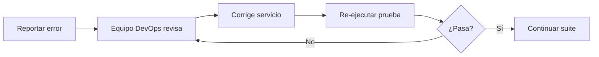

# 📊 Resumen Ejecutivo - Caso de Prueba CPI-001

## Estado General
**❌ PRUEBA FALLIDA - BLOQUEADA**

## Información Básica
- **Test ID**: CPI-001
- **Fecha**: 2025-10-28 13:56:12
- **Ambiente**: QA
- **Duración Total**: 10.85 segundos
- **Ejecutado por**: Script automatizado Python

---

## 📈 Resultados por Paso

```
┌─────────────────────────────────────────────────────────────┐
│ PASO 1: Generate Token                                      │
├─────────────────────────────────────────────────────────────┤
│ Estado:   ✅ EXITOSO                                        │
│ Duración: 478 ms                                            │
│ API:      https://qa-api-pw.izipay.pe/security/v1/...      │
│ Status:   200 OK                                            │
│ Code:     00 (Aprobado)                                     │
└─────────────────────────────────────────────────────────────┘

Token JWT Generado:
  • TokenId: 0ab78e53-1a49-4f81-9604-b6c1b9d6075f
  • MerchantCode: 4078370
  • Amount: 100.00
  • Expira en: 15 minutos
  • Formato: Válido JWT (HS256)

┌─────────────────────────────────────────────────────────────┐
│ PASO 2: Search Installments                                 │
├─────────────────────────────────────────────────────────────┤
│ Estado:   ❌ FALLÓ                                          │
│ Duración: 10,374 ms (ANÓMALO)                               │
│ API:      https://qa-api-pw.izipay.pe/Installments/v1/...  │
│ Status:   500 Internal Server Error                         │
│ Error:    "The API Controller service threw an error"       │
└─────────────────────────────────────────────────────────────┘
```

---

## 🔍 Análisis del Problema

### ⚠️ Error Crítico Identificado

**Servicio**: Search Installments API
**Código HTTP**: 500
**Mensaje**: "The API Controller service threw an error. Check the errors field to view possible details."

### 🎯 Impacto

- **Criticidad**: ALTA
- **Tipo**: Error del Servidor
- **Ambiente afectado**: QA
- **Bloquea**: Pruebas de integración completas

### 🔎 Síntomas

1. ✅ Token se genera correctamente (API Security funciona)
2. ❌ Error 500 al intentar buscar cuotas
3. ⏱️ Tiempo de respuesta excesivo (10.4 segundos vs 2 segundos esperados)
4. 📄 Mensaje de error genérico sin detalles específicos

---

## 💡 Posibles Causas

| # | Causa | Probabilidad | Impacto |
|---|-------|--------------|---------|
| 1 | Servicio Installments caído en QA | Alta | Alto |
| 2 | URL incorrecta para ambiente QA | Media | Alto |
| 3 | Merchant sin configuración de cuotas | Media | Medio |
| 4 | BIN no registrado en QA | Media | Bajo |
| 5 | Timeout en base de datos | Media | Alto |
| 6 | Error en lógica de negocio | Baja | Alto |

---

## ✅ Aspectos Positivos

1. **API de Generate Token funciona perfectamente**
   - Respuesta rápida (478 ms)
   - Token JWT válido generado
   - Credenciales aceptadas correctamente

2. **Script de prueba operativo**
   - Ejecuta ambos pasos correctamente
   - Captura evidencias completas
   - Genera reportes detallados
   - Manejo de errores robusto

3. **Documentación completa generada**
   - Resultado en JSON y TXT
   - Análisis detallado
   - Scripts de diagnóstico

---

## 📋 Acciones Inmediatas Requeridas

### 🚨 Prioridad 1 - Crítica

1. **Verificar estado del servicio Installments**
   ```bash
   python diagnose_environment.py
   ```

2. **Revisar logs del servidor**
   - Timestamp: 2025-10-28 13:56:12 - 13:56:23
   - TransactionId: TXN1761677772192
   - TokenId: 0ab78e53-1a49-4f81-9604-b6c1b9d6075f

3. **Validar configuración del ambiente QA**
   - Confirmar URL correcta del endpoint
   - Verificar servicios levantados
   - Validar conexión a base de datos

### ⚡ Prioridad 2 - Alta

4. **Verificar configuración del Merchant**
   - MerchantCode: 4078370
   - Confirmar existe en QA
   - Validar configuración de cuotas

5. **Validar BIN de prueba**
   - BIN usado: 545545
   - Confirmar está registrado en QA
   - Obtener lista de BINs de prueba válidos

### 🔄 Prioridad 3 - Media

6. **Probar en ambiente alternativo**
   - Ejecutar mismo test en Sandbox
   - Comparar resultados
   - Identificar diferencias

---

## 📁 Archivos Generados

Todos los archivos están en: `c:\IZIPAY\cuotas\CPI-001\`

### 🔧 Scripts
- `test_cpi_001.py` - Script principal de prueba
- `diagnose_environment.py` - Script de diagnóstico

### 📊 Resultados
- `test_result.json` - Resultado completo en JSON
- `test_report.txt` - Reporte en texto
- `step_1_Generate_Token.json` - Detalle Paso 1
- `step_2_Search_Installments.json` - Detalle Paso 2

### 📖 Documentación
- `README.md` - Guía de uso
- `ANALISIS_RESULTADOS.md` - Análisis técnico detallado
- `RESUMEN_EJECUTIVO.md` - Este documento

---

## 🔄 Siguientes Pasos

### Opción A: Resolver en QA (Recomendado)



### Opción B: Probar en Sandbox (Alternativa)

1. Modificar configuración en `test_cpi_001.py`:
   ```python
   CONFIG = {
       "token_url": "https://sandbox-api-pw.izipay.pe/security/v1/Token/Generate",
       "installments_url": "https://sandbox-api-pw.izipay.pe/Installments/v1/Installments/Search",
       "merchant_code": "4007701",
       "public_key": "{SANDBOX_KEY}"
   }
   ```

2. Ejecutar: `python test_cpi_001.py`

3. Comparar resultados

---

## 📞 Contactos y Escalación

### Para Reportar el Problema

**Incluir**:
- Este resumen ejecutivo
- Archivo `test_result.json`
- Archivo `ANALISIS_RESULTADOS.md`
- TransactionId: `TXN1761677772192`
- TokenId: `0ab78e53-1a49-4f81-9604-b6c1b9d6075f`

**Equipos a contactar**:
1. ⚙️ DevOps / Infraestructura (servicio caído)
2. 👨‍💻 Desarrollo Backend (error de aplicación)
3. 🧪 QA Team Lead (ambiente de pruebas)

---

## 📊 Métricas de la Prueba

```
┌─────────────────────────────────────┐
│ MÉTRICAS DE RENDIMIENTO             │
├─────────────────────────────────────┤
│ Generate Token                      │
│   • Tiempo: 478 ms    ✅ < 2s       │
│   • Status: 200       ✅ OK          │
│   • Code: 00          ✅ Aprobado    │
├─────────────────────────────────────┤
│ Search Installments                 │
│   • Tiempo: 10,374 ms ❌ > 2s       │
│   • Status: 500       ❌ Error       │
│   • Code: 500         ❌ Fallo       │
└─────────────────────────────────────┘

Tiempo Total: 10.85 segundos
Meta: < 4 segundos
Desviación: +170%
```

---

## 🎯 Conclusión

El caso de prueba **CPI-001 ha cumplido su objetivo** de validar el flujo de integración, identificando exitosamente un **problema crítico en el ambiente QA**:

> El API de Search Installments no está operativo, retornando errores 500 con tiempos de respuesta elevados.

**Estado**: 🚫 BLOQUEADO - Requiere intervención técnica

**Próxima acción**: Contactar al equipo de DevOps/Infraestructura con la evidencia recopilada.

---

**Generado**: 2025-10-28 13:56:23
**Script**: test_cpi_001.py
**Versión**: 1.0
